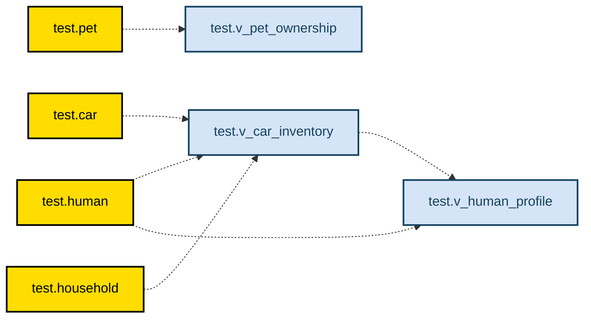

# ClickHouse Views to Mermaid

A tool that converts ClickHouse views into Mermaid diagram syntax for easy visualization of data pipeline dependencies.

## Features

- Parse ClickHouse view definitions parsing using ANTLR4 grammar from https://github.com/ClickHouse/ClickHouse/blob/master/utils/antlr
- Support for complex view hierarchies
- Generate Mermaid flowchart diagrams

## Output Sample


## Installation

```bash
# Clone the repository
git clone https://github.com/dmserg/clickhouse-views-to-mermaid.git
cd clickhouse-views-to-mermaid
```

## Usage

Define env vars to run `ch_view_dependencies.py`
```bash
CH_HOST - host name
CH_PORT - port name
CH_USER - user name
CH_PASSWORD - password
CH_SECURE - 0/1 - secure connection
```

Then run
```
python ch_view_dependencies.py <output mmd file>
```

## License

MIT